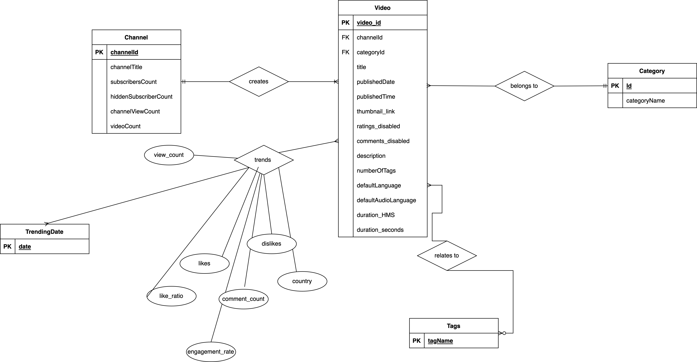

# Assumptions made in ​​the Conceptual Database Design (ER/UML):
## Video
* We make the assumption that if the comment count = -1, then it means that the comments are disabled.
* We assume that only one channel creates the video and each video must have an uploader. There is no collaboration on the upload.
* We assume that we will be able to get the target demographic language from the YouTube API. 
## Trending
* We assume that a video can trend multiple times on different dates and if it trends again, it contains the same qualities as the previous trending instance, while some fields like view count and comment count will change.
## Category
* We assume that the category_id will be made uniform across all countries. We will combine the different categories from different countries with unique ids if it is not already. 
* We assume that we will be able to get the category description from the YouTube API. 
## Channel
* We assume that we will be able to get the number of subscribers / sponsors (people who pay to subscribe to that YouTube channel) from the YouTube API.
* We assume that we will only put the channel, which has created at least one trending video, will be added to our database.
## Tags
* We assume that we will be able to split the tags based off of the delimiter (“|”). 
* We assume that we will only put the tags that are shown for the trending videos will be added to our database.
# Cardinalities
* There is one mandatory to many mandatory from Channel to Video.
* There is a many optional to many mandatory relationship from TrendingDate to Video.
* There is a many optional to many mandatory relationship from Tags to Video.
* There is one to many relationship from Category to Video.


# Logical Design (Relational Schema):
```
Channel(channelId:VARCHAR(255) [PK], channelTitle:VARCHAR(255), subscribersCount:INT, hiddenSubscriberCount:BOOL, channelViewCount:INT, videoCount:INT)


Video(video_id:VARCHAR(255) [PK], channelId:VARCHAR(255)[FK to Channel.channelId], categoryId:INT [FK to Category.Id], title:VARCHAR(255), publishedDate:DATE, publishedTime:TIME, thumbnail_link:VARCHAR(255), ratings_disabled:BOOL, comments_disabled:BOOL, description:TEXT, numberOfTags:INT, defaultLanguage:VARCHAR(255), defaultAudioLanguage:VARCHAR(255), duration_HMS:VARCHAR(255), duration_seconds:INT)


Category(Id:INT [PK], categoryName:VARCHAR(255))


Tags(tagName[PK]:VARCHAR(255))


TrendingDate(date:DATE [PK])


Trending(date, video_id:DATE, INT [PK], view_count:INT, likes:INT, dislikes:INT, like_ratio:REAL, comment_count:INT, engagement_rate:REAL, country:VARCHAR(255))


VideoTags(video_id:INT, tagName:VARCHAR(255)[PK])


```


# Diagram


