# CREATE TABLE DDL Commands
```
DROP TABLE IF EXISTS Channel;

CREATE TABLE Channel (
channelId VARCHAR(255) PRIMARY KEY NOT NULL,
channelTitle VARCHAR(255) NOT NULL,
subscribersCount INT DEFAULT NULL,
hiddenSubscriberCount TINYINT(1) DEFAULT NULL,
channelViewCount INT DEFAULT NULL,
videoCount INT DEFAULT NULL
);

DROP TABLE IF EXISTS Category;

CREATE TABLE Category (
id INT PRIMARY KEY NOT NULL,
categoryName VARCHAR(255) NOT NULL
);

DROP TABLE IF EXISTS Video;

CREATE TABLE Video (
videoId VARCHAR(255) PRIMARY KEY NOT NULL,
channelId VARCHAR(255) NOT NULL,
categoryId INT NOT NULL,
title VARCHAR(255) NOT NULL,
publishedDate DATE NOT NULL,
publishedTime TIME NOT NULL,
thumbnail_link VARCHAR(255) NOT NULL,
ratings_disabled TINYINT(1) NOT NULL,
comments_disabled TINYINT(1) NOT NULL,
description TEXT NOT NULL,
numberOfTags INT NOT NULL,
defaultLanguage VARCHAR(255) DEFAULT NULL,
defaultAudioLanguage VARCHAR(255) DEFAULT NULL,
duration_HMS VARCHAR(255) DEFAULT NULL,
duration_seconds INT DEFAULT NULL,
FOREIGN KEY (channelId) REFERENCES Channel(channelId) ON DELETE CASCADE ON UPDATE CASCADE,
FOREIGN KEY (categoryId) REFERENCES Category(Id) ON DELETE CASCADE ON UPDATE CASCADE
);

DROP TABLE IF EXISTS Tag;

CREATE TABLE Tag (
tagName VARCHAR(255) PRIMARY KEY NOT NULL
);

DROP TABLE IF EXISTS TrendingDate;

CREATE TABLE TrendingDate (
date DATE PRIMARY KEY NOT NULL
);

DROP TABLE IF EXISTS Trending;

CREATE TABLE Trending (
date DATE NOT NULL,
videoId VARCHAR(255) NOT NULL,
view_count INT NOT NULL,
likes INT NOT NULL,
dislikes INT NOT NULL,
like_ratio REAL DEFAULT NULL,
comment_count INT NOT NULL,
engagement_rate REAL DEFAULT NULL,
country VARCHAR(255) NOT NULL,
PRIMARY KEY(date, videoId)
);

DROP TABLE IF EXISTS VideoTag;

CREATE TABLE VideoTag (
videoId VARCHAR(255) NOT NULL,
tagName VARCHAR(255) NOT NULL,
PRIMARY KEY(videoId, tagName)
);

```

# Database Deployed on GCP
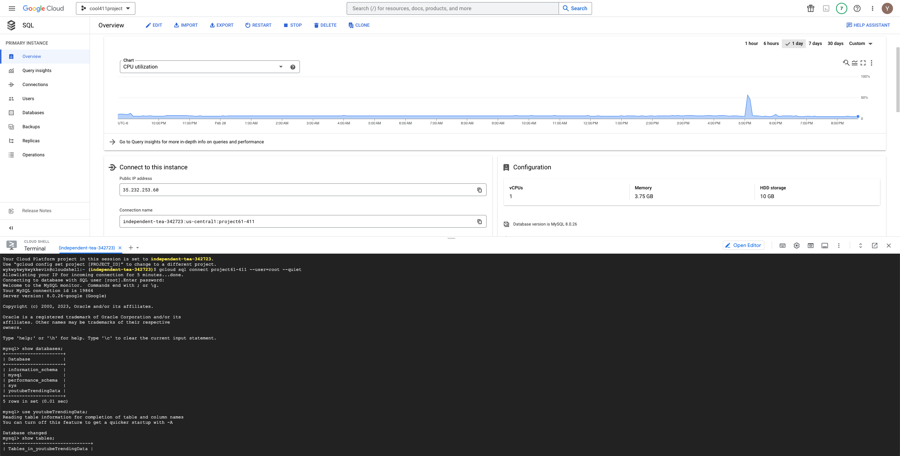

# Table with Row Counts
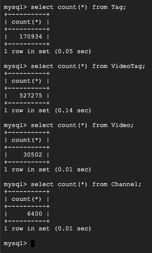

# Advanced SQL Queries

## First Advanced SQL Query
Get the top distinct video titles with the highest number of likes that are longer than 10 minutes and have at least 100k comments. 
This query uses JOIN and GROUP BY
```
SELECT DISTINCT title, sum(likes) as videoLikeCount
FROM Video NATURAL JOIN Trending
WHERE duration_seconds >= 600 and comment_count >= 100000
GROUP BY videoId
ORDER BY videoLikeCount DESC;
```
Top 15 results of the query:
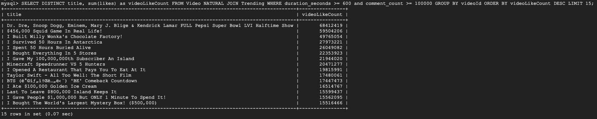

Performance when there is no new index added:
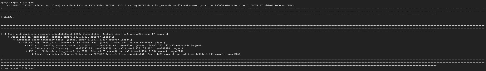

The first index is on the `Trending(comment_count)` field. We pick this index because the query filters by comment_count. We can see that the performance is improved by using the new index when filtering the `comment_count` field. Previously the cost for the comment count filter was 20041.80 and it decreased to 970.46.
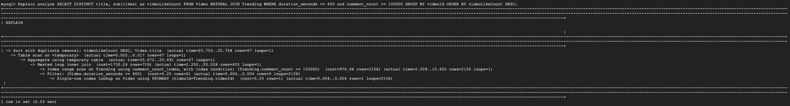

The second index is on the `Video(duration_seconds)` field. We pick this index because the query filters by duration_seconds. This index didn’t change the performance of the query and we didn't see the index being used in the analysis. We believe there are two possible reasons. First is that the query currently uses the index of the primary key to do the work. If the new index doesn't have a better performance than the primary key index, it will not affect the query. The other possible reason is that the filter of duration_seconds>600 doesn't filter out many of the rows. Therefore, the query still needs to go through most of the rows to get the result. In this case, the index doesn't provide much help.
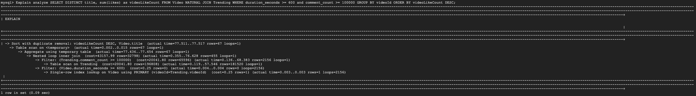

The third index is on the `Trending(likes)` field. We pick this index because all the other filters of the query uses primary key. `likes` is used in aggregation, so we want to see if using index will help on that. This index didn’t change the performance of the query and we didn't see the index being used in the analysis. We believe this is because after doing all the filtering, the query will need all the remaining rows and then do the aggregation. When we need all the rows, the index won't help improve the performance.
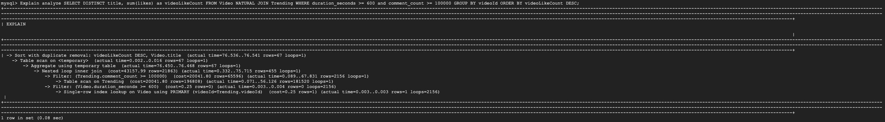


## Second Advanced SQL Query
Get the top channel Ids and the total trending count for the channels whose videos, with at least a million views and a like ratio larger than 99%, but not 100%, have been trending for the highest number of times.
This query uses JOIN, subquery, and GROUP BY
```
SELECT channelId, sum(videoTrending.trendingCount) as channelTrendingCount
FROM Video NATURAL JOIN (SELECT videoId, count(date) as trendingCount
				FROM Trending
				WHERE like_ratio > 0.99 and like_ratio <> 1 and view_count >=1000000
				GROUP BY videoId) as videoTrending
GROUP BY channelId
ORDER BY channelTrendingCount DESC;
```

Top 15 results of the query:
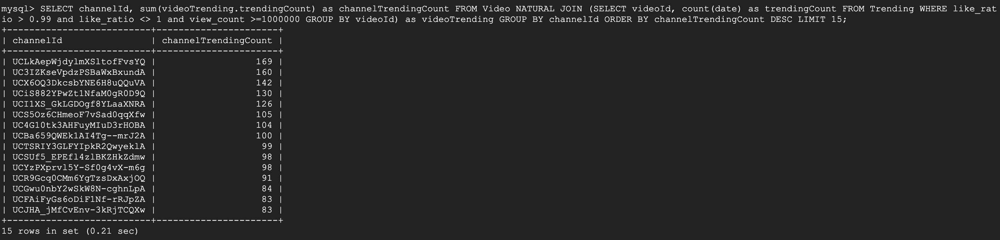

Performance when there is no new index added:
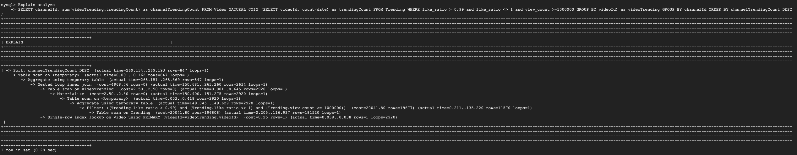

The first index is on the `Trending(like_ratio)` field. We pick this index because the query filters by like_ratio. We can see that the query uses the new index, but the performance is not improved. Previously the cost for the filter was 20041.8 and it increased to 20650.56. We believe this is because although indexing makes looking for the rows more efficient, filtering with two conditional makes it still needs to find the rows that meet the other condition. Therefore, indexing on one condition doesn't provide much help.
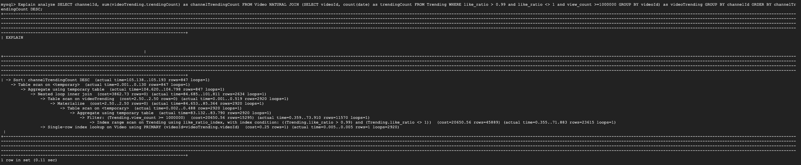

The second index is on the `Trending(view_count)` field. We pick this index because the query filters by view_count. The index was not being used, and thus having no effect on the query performance. We think this is because filtering by view_count still returns a large portion of the rows from the table. Therefore, the index doesn't help when we need to touch most of the rows in the table.


The third index is on the `Trending(like_ratio, view_count)` field. This is an index that combines the two filters together. We pick this index because the query filters by both like_ratio and view_count. We can see that the performance is improved by using the new index when filtering both fields. Previously the cost for the filter was 20041.8 and it decreased to 15835.21. By indexing on both conditional, the table can find the rows that match the requirement using this index. Therefore, the performance is improved.
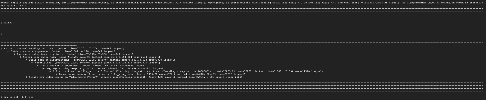

