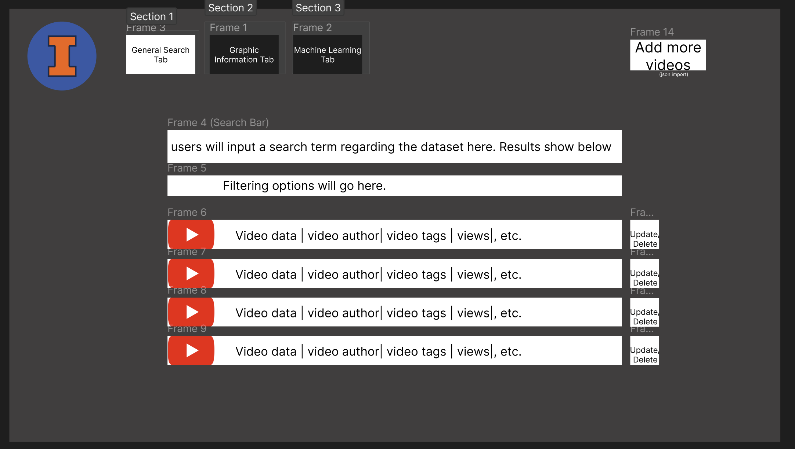
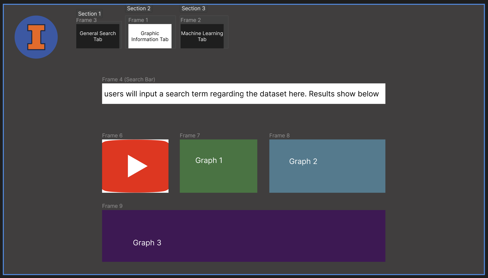
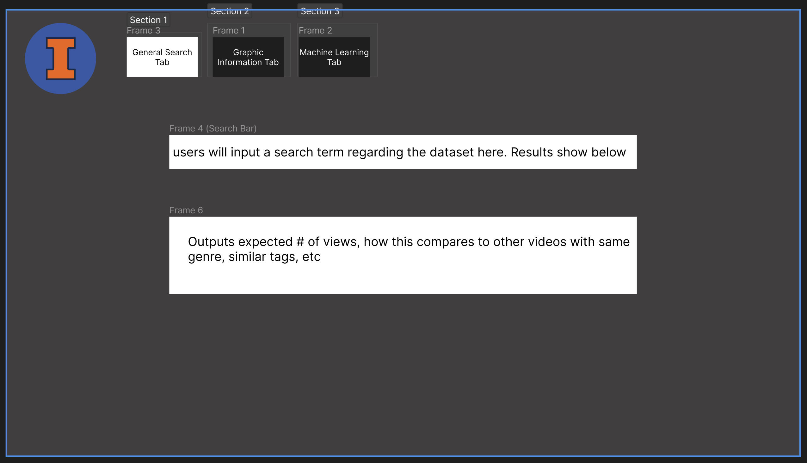

# Project Title: Youtube Trending Data

## Project Summary
This project will include a website that utilizes a database for Youtube trending videos that have been ranked and allows the user to create, update, delete, and search the data. This project will enable users to find any trending videos they wish to find based on their refined searches/filters.

The data has been collected via the YouTube API and stores information about trending videos going back several months from countries all over the world. The dataset contains the following attributes for each region: video title, channel title, publish time, tags, view count, likes/dislikes, description, and comment count.

## Application Description
This application is developed with the intent to provide YouTube users with the ability to conduct detailed searches on trending videos. Users will be able to insert, update, and delete records and see their changes reflected on the frontend interface in real time.

A special feature included in the functionality of this application will be a tool that permits YouTube users to upload videos and receive the expected number of views as output based on a machine learning model. 

## Usefulness
Currently, we are able to look at Youtube Trending from Youtube, however, it doesn’t contain all of the categories. As a result, our searching abilities are limited since we cannot search for the specific videos we want. Additionally, the current implementation doesn’t permit us to look back in time to learn what was trending in the past. By taking note of these limitations and integrating all of this information into our project, we will be able to conduct a more in depth analysis of the data based on the observable changes in various trending videos. This will provide us with more insight about what kind of videos are the most popular based on user defined constraints and how these popularity trends vary with time.
We hope to enhance the YouTube experience by implementing the functionality we have outlined in our project. We aim to increase the efficiency as well as the accuracy of searches that users conduct on a regular basis.

## Realness
We will utilize the data [Youtube data](https://www.kaggle.com/datasets/rsrishav/youtube-trending-video-dataset?select=US_youtube_trending_data.csv) from Kaggle, which is also provided by in the [document](https://docs.google.com/document/d/1Lz44h4D1w8KI7q5wNQcJ_Fvd7r7VokoFtDvMkiEkX7U/edit#heading=h.w4k8i2bifbv). We will begin by focusing on only referencing the trending data in the United States. In the case that we have additional time, we may extend our project scope to include data from other regions. The US dataset contains 16 features, including some of the following: number of likes/dislikes, view count, comment count, and tags, which provide valuable insights into what is necessary for a video to trend, why a video is trending, and where/when a video is trending. The dataset has 181990 YouTube videos listed with 33337 of those being unique videos. 

We can download the data from Kaggle by using the link above. Since the data is updated daily, we will set a certain date as the version the project will use. According to the description in the dataset, this data was collected by using the Youtube API. 

## Functionality
In this project, we would like to use the Youtube trending data in the US to build a website that allows users to look at top videos from Youtube trending by category and by date, month, and year. We will build different lists containing top ranked videos based on views, likes, like rate, number of comments, and other such metrics. The user will also have the ability to search the video by keywords. They will also be able to add restrictions to the search to increase accuracy and refine results.

We would also like to allow the user to add, update, and delete a video record in the current database. We will need to build a pipeline to automatically get data by using Youtube API to get the trending data. The new data will update the current record if the video already exists in the database, or it will create a new record in the case that it doesn’t exist. 

We hope to create a machine learning model (probably using XGBoost, or a similar gradient-boosting model) in which the user will input a video, such as a video they want to upload, and the output will be the expected amount of views that the video will receive according to our model. The output could possibly contain other data useful to the customer/user as well such as the. 

The video shows as different columns if it is a trending multiple times, we want to show which video shows the highest number of times and which video stays for the longest continuous days.

## UI mockup
[Figma link](https://www.figma.com/file/uRlugKUsVmaLZBs5Ralhzp/CS411-Figma?node-id=17%3A47&t=QigrYEU4cZA202jM-1)

## Work Distribution
Every member of the group will participate in the work required by the frontend, backend, and SQL components, while concentrating on 1-2 specific areas as described below. 

Michael will focus on filtering, aiding with SQL, and Machine Learning.

Anami will focus on the logical database design/CRUD operations in SQL along with the front-end UI design.

Lilly will focus on the web frontend and presentation of the product. 

Yuankai will focus on SQL work including writing the queries and the store procedures as an API to the web frontend and figure out how to use the Youtube API.
